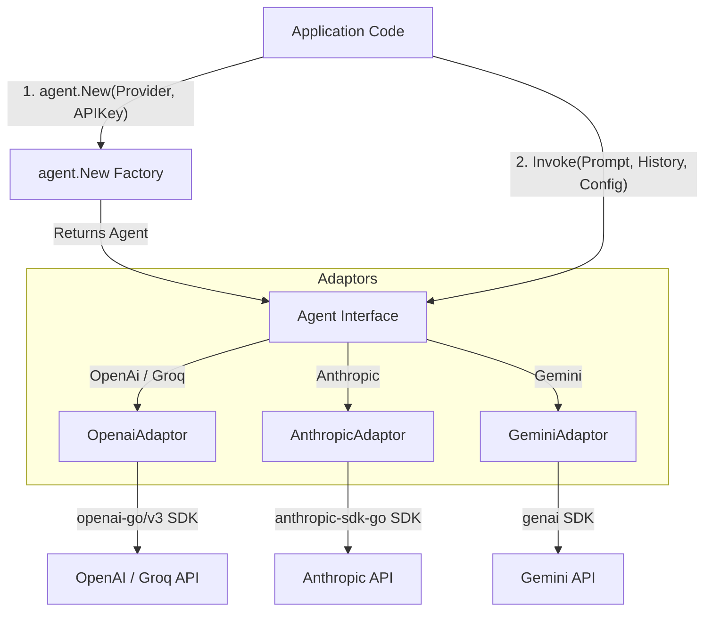

# Gochestra

A unified, lightweight Go interface that wraps multiple Large Language Model (LLM) providers. Gochestra abstracts the SDK initialization, prompt/history formatting, and request invocation across OpenAI, Anthropic, Gemini, and Groq behind a single, clean `Agent` interface. This allows developers to swap models and providers with a single configuration change.

---

## Table of Contents
- [Architecture Overview](#architecture-overview)
- [Key Features](#key-features)
- [Key Code Components](#key-code-components)
- [How It Works](#how-it-works)
  - [Unified Agent Interface](#unified-agent-interface)
  - [Provider Initialization](#provider-initialization)
  - [Adapter Pattern Integration](#adapter-pattern-integration)
  - [Stateless Execution](#stateless-execution)
- [Getting Started](#getting-started)
  - [Prerequisites](#prerequisites)
  - [Installation](#installation)
  - [Quickstart Example](#quickstart-example)
  - [Running the Code](#running-the-code)
- [License](#license)

---

## Architecture Overview


The system separates client code from LLM SDK complexities using a factory and adapter architecture. When invoking an agent, the prompt context and history are mapped to the respective provider's layout, and the response is packed into a unified return structure.

---

## Key Features
- **Unified Interface**: Swap LLM providers on the fly without changing the calling function signature.
- **Provider Coverage**: Support for OpenAI, Anthropic, Gemini, and Groq.
- **Multi-Modal Foundations**: Prompt structures built to handle text, image assets, and clipboard payloads.
- **Chat History & Memory**: Support for thread conversation states via structured message histories.
- **Zero-Friction Configuration**: Centralized model names, system instruction directives, and generation limit control.

---

## Key Code Components
- [agent/interface.go](file:///home/alok/alokxcode/gochestra/agent/interface.go): Defines the core [Agent](file:///home/alok/alokxcode/gochestra/agent/interface.go#L43) interface, the unified [ChatConfig](file:///home/alok/alokxcode/gochestra/agent/interface.go#L14), and client factory [New](file:///home/alok/alokxcode/gochestra/agent/interface.go#L62).
- [agent/openai.go](file:///home/alok/alokxcode/gochestra/agent/openai.go): Implements the [OpenaiAdaptor](file:///home/alok/alokxcode/gochestra/agent/openai.go#L9) and maps requests to the official `openai-go` SDK.
- [agent/anthropic.go](file:///home/alok/alokxcode/gochestra/agent/anthropic.go): Implements the [AnthropicAdaptor](file:///home/alok/alokxcode/gochestra/agent/anthropic.go#L9) and maps requests to the official `anthropic-sdk-go` SDK.
- [agent/gemini.go](file:///home/alok/alokxcode/gochestra/agent/gemini.go): Implements the [GeminiAdaptor](file:///home/alok/alokxcode/gochestra/agent/gemini.go#L9) and maps requests to Google's official `genai` SDK.
- [agent/default.go](file:///home/alok/alokxcode/gochestra/agent/default.go): Serves as a fallback default [DefaultAdaptor](file:///home/alok/alokxcode/gochestra/agent/default.go#L9) handler.
- [cmd/main.go](file:///home/alok/alokxcode/gochestra/cmd/main.go): The entry point [main](file:///home/alok/alokxcode/gochestra/cmd/main.go#L10) containing execution examples using Groq.

---

## How It Works

### Unified Agent Interface
At the heart of the library is the [Agent](file:///home/alok/alokxcode/gochestra/agent/interface.go#L43) interface. It exposes a single method:
```go
Invoke(prompt Prompt, history ChatHistory, cfg *ChatConfig, ctx context.Context) (*Res, error)
```
Any struct implementing this method can act as a driver for the LLM orchestration pipeline, providing complete encapsulation of provider libraries.

### Provider Initialization
When initializing a client via the factory:
1. You supply a [Provider](file:///home/alok/alokxcode/gochestra/agent/interface.go#L53) constant (e.g. `agent.OpenAi`) along with the API key.
2. The factory [New](file:///home/alok/alokxcode/gochestra/agent/interface.go#L62) function maps this to the corresponding initialization route (e.g. [initOpenai](file:///home/alok/alokxcode/gochestra/agent/interface.go#L108) or [initGemini](file:///home/alok/alokxcode/gochestra/agent/interface.go#L78)).
3. An SDK client is instantiated and wrapped into an adaptor struct returning the abstract `Agent`.

### Adapter Pattern Integration
Each provider structure translates Gochestra’s universal models at runtime:
1. **System Prompting**: Unified configurations like `SystemPrompt` are passed as system instructions, system messages, or special params depending on whether the destination is OpenAI, Anthropic, or Gemini.
2. **Payload Parsing**: The adapter maps properties like text from the [Prompt](file:///home/alok/alokxcode/gochestra/agent/interface.go#L20) and iterates through the [ChatHistory](file:///home/alok/alokxcode/gochestra/agent/interface.go#L31) slice to translate the list of custom roles/messages into native SDK messages.
3. **API Dispatching**: The client requests generation through the provider's specific endpoints.

### Stateless Execution
The library is stateless. Chat history is maintained completely caller-side. When invoking the agent, you explicitly pass the conversation history, enabling easier scaling, session persistence, and serverless environment compatibility.

---

## Getting Started

### Prerequisites
- Go version 1.22.2 or higher.

### Installation
Add the module to your Go workspace dependencies:
```bash
go get github.com/alokxcode/gochestra
```

### Quickstart Example
Swap your provider key and client parameters to switch between OpenAI and other model drivers:

```go
package main

import (
	"context"
	"fmt"
	"os"

	"github.com/alokxcode/gochestra/agent"
)

func main() {
	// Initialize OpenAI Agent
	ag := agent.New(agent.OpenAi, os.Getenv("OPENAI_API_KEY"))

	cfg := &agent.ChatConfig{
		Model:        "gpt-4o-mini",
		SystemPrompt: "You are a helpful assistant.",
		MaxToken:     200,
	}

	prompt := agent.Prompt{Text: "Tell me a joke about compilers."}

	// Invoke the provider
	res, err := ag.Invoke(prompt, nil, cfg, context.Background())
	if err != nil {
		panic(err)
	}

	// Output result
	fmt.Println(res.Content.Openai.Choices[0].Message.Content)
}
```

### Running the Code
1. Export your API keys:
   ```bash
   export OPENAI_API_KEY="your_api_key"
   ```
2. Build the command-line helper:
   ```bash
   go build ./...
   ```
3. Run the development verification tool:
   ```bash
   go run cmd/main.go
   ```

---

## License
MIT License - Feel free to use and modify!

---
